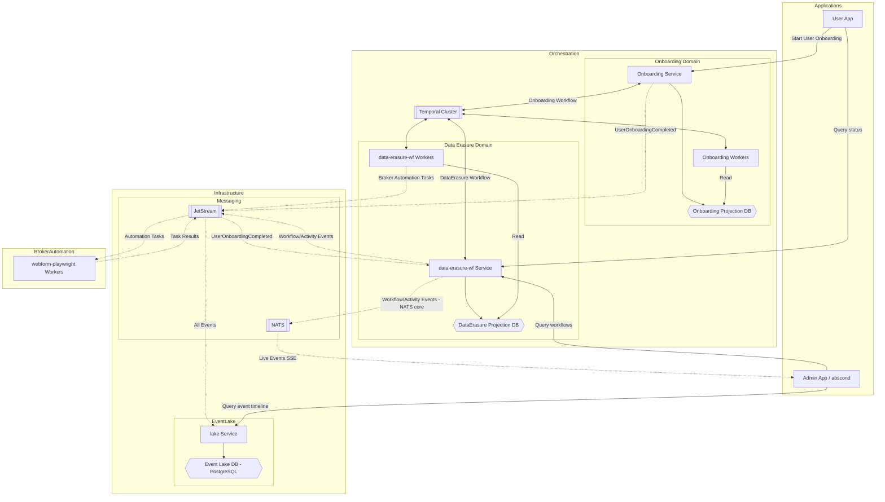

# optout-io System Architecture

> **Living document.** Updated as the system evolves. For *why* decisions were made, see `decisions/`. For *what* is being built next, see `designs/`.

---

## Purpose

optout-io automates privacy opt-out requests (GDPR, CCPA, DPPA) on behalf of users across hundreds of data brokers. The system submits, tracks, and verifies erasure requests through a combination of API calls and browser automation.

---

## Component Map

---

## Components

### data-erasure-wf
**Repo:** `data-erasure-wf/`  
**Role:** Core orchestration service. Owns the data erasure domain.

- Consumes `UserOnboardingCompleted` from NATS/JetStream to start erasure workflows
- Runs Temporal workflows (`DataErasureWorkflow`) that coordinate erasure across all relevant brokers
- Broker-specific sub-workflows (e.g., Acxiom, DeepSync) run as child workflows
- Publishes workflow/activity telemetry events to JetStream for the lake
- Exposes gRPC API for querying workflow state
- Stack: Go, Temporal v1.33+, NATS/JetStream, PostgreSQL

### lake
**Repo:** `lake/`  
**Role:** Append-only event store. Consumes all domain events from JetStream and persists them.

- Ingests workflow and activity lifecycle events
- Handles Temporal replay deduplication (idempotent inserts)
- Exposes gRPC query API: fetch events by aggregate ID (used by admin timeline)
- Stack: Go, NATS/JetStream, PostgreSQL, golang-migrate

### abscond
**Repo:** `abscond/`  
**Role:** Internal admin dashboard. Real-time observability over workflows.

- SSE-based real-time event streaming (Datastar hypermedia framework)
- Subscribes to NATS core (`com.optmeout.dataerasure.workflow.progress`) for live workflow events; broadcasts to browser via SSE `PatchSignals`
- Workflow timeline drawer: shows per-workflow activity status, deep links to Temporal UI
- Calls `data-erasure-wf` gRPC API for workflow list/detail; calls `lake` gRPC API for event history
- Stack: Go, Chi, Templ, Datastar, gRPC, NATS core, OpenTelemetry

### webform-playwright
**Repo:** `webform-playwright/`  
**Role:** Browser automation worker. Executes opt-out form submissions at data brokers.

- Config-driven: brokers defined in YAML with Mustache templating — no new code per broker
- Playwright handles DOM interaction, screenshot capture, form submission
- Runs as a Temporal worker, receives tasks from `data-erasure-wf`
- Stack: TypeScript, Playwright v1.53+, Node 22, Temporal worker

### contracts
**Repo:** `contracts/`  
**Role:** Shared protobuf schema definitions. The contract layer between all services.

- Published as both Go and TypeScript packages
- Covers: workflow telemetry events, URN definitions, lake gRPC service API
- Strict backward compatibility — never break existing fields
- Stack: Protocol Buffers, buf, GitHub Actions for codegen

### go-common
**Repo:** `go-common/`  
**Role:** Shared Go infrastructure library.

- Logging setup (structured, OpenTelemetry-aware)
- OTel initialization
- URN parsing/extraction utilities
- Workflow logger abstraction
- Domain-agnostic by design — no business logic, no circular deps

### Onboarding Service
**Repo:** not yet in this workspace (separate service)  
**Role:** Handles user signup/onboarding workflow. Publishes `UserOnboardingCompleted` which triggers data erasure.

---

## Cross-Cutting Concerns

### Identifiers — URNs
All entities (users, workflows, brokers, activities) are identified by URNs. Format defined in `contracts/`. Utilities in `go-common/`.

### Messaging — NATS/JetStream
All async communication is via JetStream. Events are durable, ordered per-subject. Services never call each other directly for async operations.

### Workflow Orchestration — Temporal
All multi-step, stateful processes run as Temporal workflows. Temporal provides retry logic, timeouts, visibility, and replay-safe execution. Workers are separate binaries from services.

### Observability
- Structured logging via `go-common`
- OpenTelemetry traces exported from all Go services
- Event timeline via `lake` + `abscond`
- Temporal UI for workflow-level debugging

### Schema Evolution
All inter-service contracts live in `contracts/`. Changes require backward-compatible protobuf evolution. Breaking changes require a new message version.

---

## Key Invariants

1. **Domain-owned storage**: each domain service owns its own projection DB. No cross-domain DB reads.
2. **lake is append-only**: events are never updated or deleted. Deduplication is at ingestion.
3. **Temporal workers are stateless**: all durable state lives in Temporal + the projection DB.
4. **Broker automation is config-driven**: adding a new data broker requires a YAML config in `webform-playwright`, not code changes in the orchestration layer.
5. **contracts defines the API surface**: services communicate via protobuf contracts, not shared Go structs.
