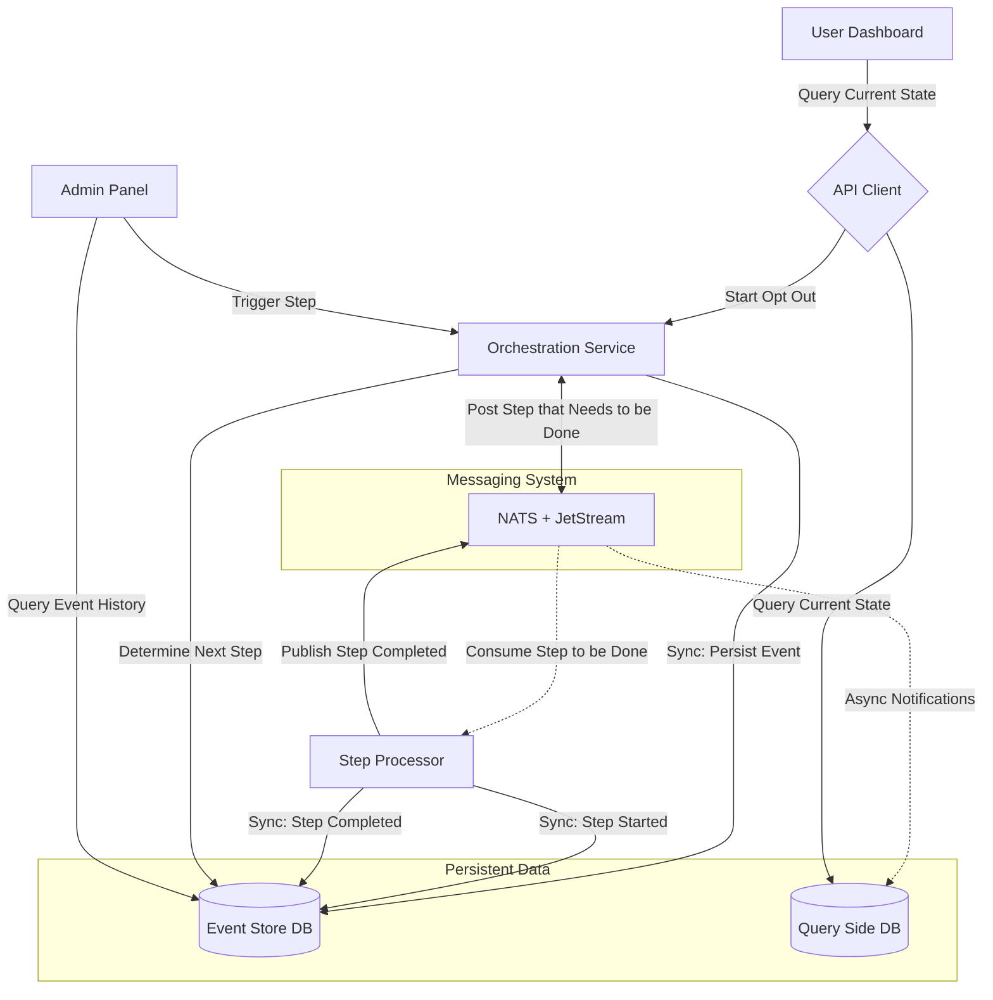
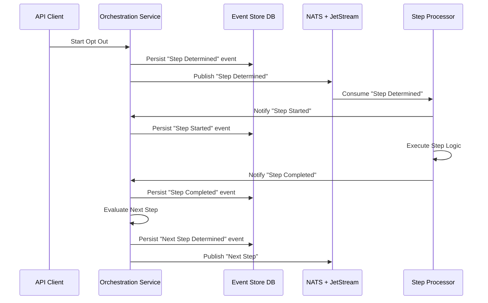
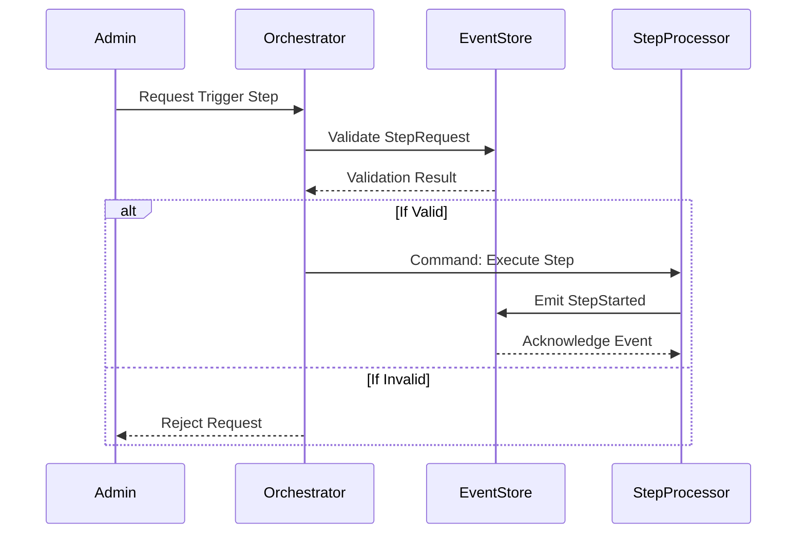

# ADR-002: V1 System Design

**Status:** Superseded by current architecture (see ARCHITECTURE.md)  
**Date:** 2024 (initial design phase)

> Kept for historical reference. The V1 design established the core event-sourcing and orchestration patterns that carried forward into V2.

---

## Flow Chart

---

## Sequence Diagram — Opt Out

---

## Sequence Diagram — Customer Service Agent (Manual Trigger)

---

## Key Differences from Current Architecture

| V1 Concept | Current Equivalent |
|---|---|
| Orchestration Service | `data-erasure-wf` service |
| Step Processor | Temporal workers + `webform-playwright` |
| Event Store DB | `lake` service + PostgreSQL |
| Query Side DB | Per-domain projection DBs in each service |
| Admin Panel | `abscond` |
